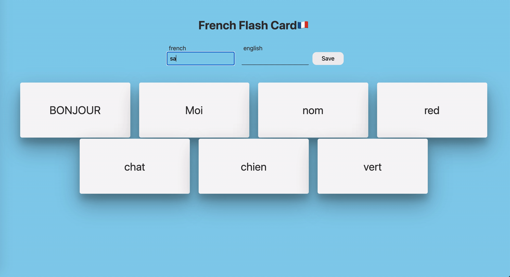

# Flashcards for French-English🇫🇷


When I am studying new languages, I like to use 'Flash Cards'.
Basically, you write a word in what you are learning on the front, the explanation on the another side.
You can FLIP to check the answer to quickly memorize them🤓


So, I have developed this for myself, and even better we can play around with the Svelte and FastAPI 


For now only `backend` is shipped by DOCKER🐳

To use this,
```shell
docker-compose up --build
```

To open the develop version of frotnend,
```shell
cd frontend/
npm run dev
```
and you will be able to open `localhost:5000` and can play around!

I am trying to deploy them as well (🔜🤓)

Voilà!

Here is how it looks like!

